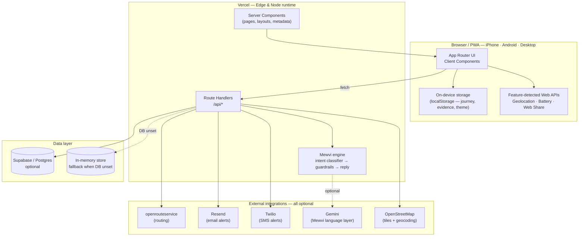

<p align="center">
  
</p>

<h1 align="center">ASSURED</h1>
<p align="center"><i>Your safety assurance</i></p>

<p align="center">
  
  
  
  
  
</p>

<p align="center">
  A single, connected safety ecosystem for India — emergency help, verified
  helplines, incident reporting, travel safety, community reports, and a
  floating assistant called <b>Mewvi</b> — built as one Next.js app with a
  proper page for every feature, not one giant scrolling screen.
</p>

---

## Table of contents

- [Why ASSURED](#why-assured)
- [Features](#features)
- [Tech stack](#tech-stack)
- [Architecture](#architecture)
- [Route map](#route-map)
- [Project structure](#project-structure)
- [Getting started](#getting-started)
- [Environment variables](#environment-variables)
- [Deployment](#deployment)
- [CI/CD pipeline](#cicd-pipeline)
- [What's real vs. a placeholder](#whats-real-vs-a-placeholder)
- [Security & privacy](#security--privacy)
- [Roadmap](#roadmap)
- [Docs](#docs)

## Why ASSURED

Most "safety apps" are reactive — call this number if something already
went wrong. ASSURED is built to be proactive: helping people prepare,
check in, share their journey, organize evidence, and reach the right
verified resource *before* things go wrong, for women, students,
travelers, children, senior citizens, night-shift workers, and everyday
commuters.

Every claim the app makes is either real and working, or clearly labeled
as a placeholder — nothing is faked to look more finished than it is.

## Features

| Domain | What it does |
|---|---|
| 🆘 **Emergency** | One-tap `tel:112` access plus the most relevant emergency helplines |
| 📞 **Helplines** | Searchable, filterable directory of verified national and state helplines, each with a source and verification date |
| 📝 **Report Center** | Guided reporting flows for cybercrime, financial fraud, and women's safety — what to do, who to contact, what evidence to keep |
| ✈️ **Travel Safety** | Route comparison, destination check-in with ETA, live guardian tracking, and location sharing with expiring links |
| 👥 **Guardian** | A read-only, token-gated view a trusted contact opens to follow a journey |
| 🌐 **Community** | Community-submitted safety observations plotted on a safety map, moderation-ready |
| 🗂️ **Evidence Organizer** | On-device notes, files, and a timeline for an incident, exportable |
| 🐱 **Mewvi** | A context-aware assistant present on every page — rule-based by default, optionally sharpened by Gemini, and never a general-purpose chatbot |
| 🌓 **Theming** | Light, dark, and system modes with persisted preference |

## Tech stack

- **Framework:** Next.js 14 (App Router) + TypeScript
- **Styling:** Tailwind CSS
- **Data:** Supabase/Postgres (optional — falls back to in-memory storage when unset)
- **Integrations (all optional):** openrouteservice (routes), Resend (email alerts), Twilio (SMS alerts), Gemini (Mewvi's language layer)
- **Deployment:** Vercel

## Architecture

ASSURED is **one Next.js app, one repo, one deployment** — not a
collection of microservices. "Ecosystem" refers to how the *product*
feels (every domain has its own real page and URL, like Wikipedia),
not to how it's deployed. Every box below runs inside the same Next.js
build; the only things that live outside it are the optional external
services on the right, and every one of those is feature-detected and
degrades gracefully when unset.



**Layers, top to bottom:**

| Layer | Responsibility |
|---|---|
| **Client Components** (`"use client"`) | Anything interactive or device-facing — theme toggle, geolocation, the Mewvi panel, live tracking. Kept as small and low as possible in the tree; most of the app is server-rendered. |
| **Server Components & layouts** | Route shells, metadata, and static content, rendered on the server for fast first paint and no client JS cost. |
| **Route Handlers** (`src/app/api/**`) | The only code allowed to touch secrets (`src/lib/env.ts` → `serverEnv`) or the database. Every mutating route is rate-limited and validates its input with Zod. |
| **Mewvi engine** (`src/lib/mewvi/**`) | Rule-based intent classification and a catalog of verified in-app answers by default; Gemini only ever *rewrites* an already-approved reply and is never given free rein to invent facts — see [`AI_SAFETY.md`](./AI_SAFETY.md). |
| **Data layer** | Supabase/Postgres when configured, with Row-Level Security and no public policies. With no database configured, the same API surface runs on an in-memory store so the whole app — including journeys and guardian tracking — still works end to end for a local demo. |
| **External integrations** | openrouteservice, Resend, Twilio, Gemini, and OpenStreetMap. Each is read from `serverEnv`, feature-detected, and the UI states plainly when one isn't configured rather than pretending it is. |

**Why one app instead of separate services:** a hackathon judge (or a
first-time contributor) should be able to clone one repo, run one
`npm install`, and see the whole product — not stitch together five
deployments. Splitting by *route*, not by *service*, is what gives
ASSURED its Wikipedia-like feel (`/travel/guardian`, `/report/cyber`,
etc. are all real, deep-linkable, independently refreshable pages)
without any of the operational cost of actual microservices.

## Route map

<details>
<summary>Expand full route table</summary>

| Route | Purpose |
|---|---|
| `/` | Home — hub with SOS shortcut and the six safety domains |
| `/emergency`, `/emergency/quick` | Emergency actions and a printable quick-reference variant |
| `/helplines`, `/helplines/national`, `/helplines/states` | Verified helpline directory |
| `/women`, `/children` | Dedicated safety hubs |
| `/cyber`, `/cyber/scam-call` | Cyber safety guidance and a scam-call helper |
| `/report`, `/report/women`, `/report/cyber`, `/report/financial-fraud` | Reporting workflows |
| `/travel`, `/travel/routes`, `/travel/check-in`, `/travel/guardian` | Travel safety tools |
| `/location/share`, `/guardian` | Location sharing and the guardian's read-only view |
| `/community`, `/safety-map`, `/safety-map/area` | Community reports and the safety map |
| `/evidence` | Evidence organizer |
| `/resources` | Verified guides across every category |
| `/settings` | Theme, privacy, and emergency contact settings |
| `/demo` | Guided, presenter-controlled demo walkthrough |

</details>

## Project structure

```
src/
├── app/          # routes, grouped by domain — (emergency), (travel), (cyber)...
├── components/   # shell, ui, and feature-specific components
├── features/     # feature-level logic per domain
├── data/         # verified helpline & resource data (typed JSON)
├── lib/          # navigation, server logic, security, theme
├── hooks/        # shared React hooks
└── types/        # shared TypeScript types
```

## Getting started

```bash
npm install
cp .env.example .env.local
npm run dev      # http://localhost:3000
```

Requires Node.js 18.18+ (Node 20+ recommended). Nothing in `.env.local`
is required to run the app — every integration is optional and the app
tells you in-settings exactly which ones are missing.

```bash
npm run build    # production build
npm run lint     # lint
npm test         # test suite
```

## Environment variables

All variables are optional — see [`.env.example`](./.env.example) for
the full list with inline comments. Only variables prefixed
`NEXT_PUBLIC_` are ever exposed to the browser; everything else stays
server-side.

## Deployment

1. Push this repo to GitHub.
2. On [Vercel](https://vercel.com): **New Project** → import the repo
   (Next.js is auto-detected) → add any env vars you want → **Deploy**.
3. Every push to the connected branch redeploys automatically.

This is a static-export-incompatible app (App Router + API routes), so
GitHub Pages can't host it as-is — use Vercel, Netlify, or another host
with first-class Next.js support.

## CI/CD pipeline

[](https://github.com/OWNER/REPO/actions/workflows/ci.yml)
<br/><sub>Replace `OWNER/REPO` above with this repo's GitHub path once pushed, so the badge (and the link) resolve.</sub>

A GitHub Actions workflow at [`.github/workflows/ci.yml`](./.github/workflows/ci.yml)
runs on every push and pull request to `main`:

```
checkout → npm ci → type check (tsc) → lint → unit tests → production build
```

It needs no secrets and injects none — the app is designed to build and
run with every integration unset (that's the whole point of `serverEnv`
in [`src/lib/env.ts`](./src/lib/env.ts)), so CI exercises exactly the
same "nothing configured" path a fresh clone does. A red check on a PR
means one of those four steps failed; open the run's log to see which.

**Continuous deployment** is handled by Vercel's own GitHub
integration (see [Deployment](#deployment) above) rather than a step in
this workflow — Vercel builds and deploys independently on every push,
with its own preview URL per pull request.

## What's real vs. a placeholder

ASSURED never claims functionality it doesn't have. A shared
`FeatureStatusBadge` marks every feature as **available**,
**coming later**, or **browser-limited**, so nothing in the UI silently
does nothing.

- ✅ **Working now:** helpline directory, report guides, travel check-in & guardian tracking, location sharing, community reports + safety map, evidence organizer, Mewvi, email/SMS alerting (where keys are configured)
- 🚧 **Labeled as coming later:** state-level helplines, some settings sections, photo/video evidence upload
- 🌐 **Browser limits, stated plainly:** no background location tracking with the tab closed, no automatic authority notification, `tel:` links still require you to press call

## Security & privacy

- No secrets committed — `.env.example` contains placeholders only
- Guardian links are token-gated; tokens are hashed and never logged
- Location-sharing tokens expire automatically and are wiped on arrival
- Community report locations are coordinate-rounded (~100m) and auto-expire
- Rate limiting on every mutating API route
- Row-Level Security enabled on the database with no public policies — only the server can read or write

Full detail in [`AI_SAFETY.md`](./AI_SAFETY.md) (Mewvi's rules) and the
Security section of [`SETUP_GUIDE.md`](./SETUP_GUIDE.md).

## Roadmap

Things that need a native app rather than a browser, and are marked
"coming later" instead of faked:

- True background location tracking with the app closed
- Silent/panic-gesture SOS
- Push notifications
- On-device call/SMS scam screening
- Offline-first mode with cached helpline data

## Docs

- [`SETUP_GUIDE.md`](./SETUP_GUIDE.md) — full local setup and integration walkthrough
- [`AI_SAFETY.md`](./AI_SAFETY.md) — how Mewvi works and its guardrails
- [`ASSET_CHECKLIST.md`](./ASSET_CHECKLIST.md) — required and optional visual assets

---

<p align="center"><i>Safety that stays with you, wherever you go.</i></p>
